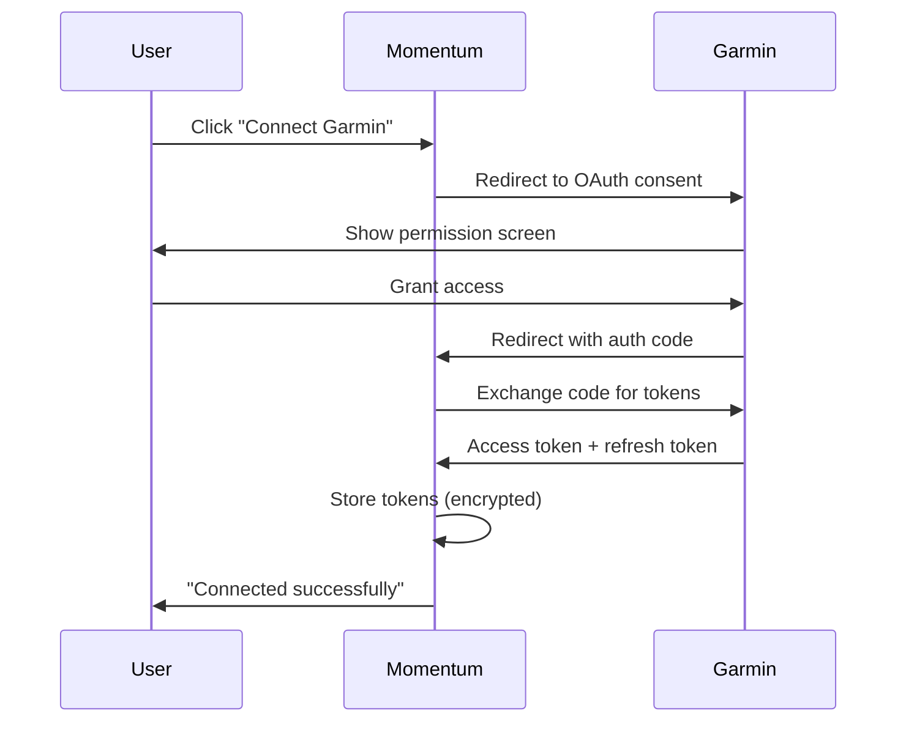

# Specification: Garmin Integration Strategy

**Task ID:** 1.5-E  
**Sprint:** 1.5 - Foundation & User Lifecycle  
**Owner:** Product Architect  
**Status:** Ready for Implementation  
**Updated:** October 11, 2025

---

## 1) Scope

### In Scope
- Strategic decision: GarminDB vs Garmin Connect API
- Sprint 1.5 implementation: GarminDB local sync (immediate value)
- Sprint 3 migration path: Garmin Connect API (multi-user scale)
- Daily wellness data sync (HRV, RHR, sleep, stress)
- Daily workout data sync (completed sessions)
- Idempotent sync process with data quality flags

### Out of Scope
- Real-time activity sync - Sprint 3 with API
- Live activity tracking - Sprint 4+
- Other wearables (Apple Health, Wahoo, Polar) - Sprint 3+
- Historical data backfill beyond 7 days - Sprint 2

---

## 2) Strategic Decision: Hybrid Approach

### Decision Summary

**Sprint 1.5 (NOW): GarminDB Local Sync**
- Read from local GarminDB SQLite database
- Daily batch sync (manual trigger initially, then cron)
- Single-user immediate value
- Zero external dependencies or API approval wait

**Sprint 3 (LATER): Migrate to Garmin Connect API**
- OAuth flow for multi-user support
- Webhook-based real-time updates
- Official Garmin Connect API integration
- Migrate existing GarminDB users seamlessly

### Rationale

#### Why GarminDB First?
✅ **Immediate value** - Works today, no API approval wait (1-2 weeks)  
✅ **Single-user MVP** - Perfect for initial product owner usage  
✅ **Zero config** - GarminDB already syncing from Fenix 8  
✅ **Learn fast** - Discover data structure and edge cases  
✅ **No breaking changes** - Migration to API is additive, not replacement  

#### Why Migrate to API Later?
✅ **Multi-user required** - Can't access other users' GarminDB  
✅ **Real-time updates** - Webhooks provide near-instant sync  
✅ **Official support** - Stable contract, documented endpoints  
✅ **Reduced maintenance** - No SQLite schema tracking  

### Risk Assessment

| Risk | Impact | Mitigation |
|------|--------|------------|
| GarminDB schema changes | Medium | Versioned parser, graceful degradation |
| API approval delay | Low | Already planned for Sprint 3 timeline |
| Migration complexity | Low | Additive approach, existing data untouched |
| API rate limits | Medium | Cache heavily, batch requests |

---

## 3) Sprint 1.5 Implementation: GarminDB Sync

### Requirements

#### FR-1: Daily Wellness Sync
**Source:** GarminDB `summary` table  
**Target:** `readiness_daily` table (existing from Cycle 1)  
**Fields:**
- `hrv_rmssd` → readiness drivers (recovery indicator)
- `resting_heart_rate` → readiness drivers
- `sleep_score` → readiness drivers
- `stress_level` → readiness drivers

#### FR-2: Daily Workout Sync
**Source:** GarminDB `activities` table  
**Target:** `sessions` table (existing from Cycle 1)  
**Fields:**
- `start_time`, `sport`, `duration_seconds`
- `distance_meters`, `avg_heart_rate`, `max_heart_rate`
- `training_stress_score` (if available)
- Activity segments → `structure_json`

#### FR-3: Idempotent Sync
- Use Garmin `activity_id` as `external_id` in sessions
- Skip already-synced activities
- Update if Garmin data changed (edge case: late upload)

#### FR-4: Data Quality Flags
- Mark partial data if wellness fields missing
- Include `data_source: 'garmin_db'` in metadata
- Log warnings for unexpected schemas

#### FR-5: Manual Trigger
- Initial version: run sync via CLI command
- Future: daily cron job (3am athlete timezone)
- Sync window: last 7 days (catch late uploads)

### Data Model

#### Existing Tables (No Changes Required)

**sessions** (from Cycle 1)
```sql
-- Already has external_id for Garmin activity tracking
CREATE TABLE sessions (
  session_id UUID PRIMARY KEY,
  athlete_id UUID NOT NULL,
  external_id TEXT,  -- Garmin activity_id goes here
  sport TEXT NOT NULL,
  date DATE NOT NULL,
  duration_seconds INTEGER,
  structure_json JSONB,
  -- ... other fields
  UNIQUE(athlete_id, external_id)  -- Prevent duplicate Garmin activities
);
```

**readiness_daily** (from Cycle 1)
```sql
-- Already supports partial data with data_quality flags
CREATE TABLE readiness_daily (
  athlete_id UUID,
  date DATE,
  drivers JSONB,  -- { hrv, rhr, sleep, stress, ... }
  data_quality JSONB,  -- { flags: ["partial_data"], source: "garmin_db" }
  score DECIMAL(3,1),
  PRIMARY KEY (athlete_id, date)
);
```

### GarminDB Schema Reference

#### Tables Used

**summary** table (daily wellness)
```sql
-- GarminDB schema (for reference, not to modify)
CREATE TABLE summary (
  day DATE PRIMARY KEY,
  hr_min INTEGER,  -- resting_heart_rate
  hr_max INTEGER,
  rmssd REAL,  -- HRV
  stress_avg REAL,
  sleep_score INTEGER,
  -- ... other fields
);
```

**activities** table (workouts)
```sql
-- GarminDB schema
CREATE TABLE activities (
  activity_id TEXT PRIMARY KEY,
  start_time TIMESTAMP,
  stop_time TIMESTAMP,
  sport TEXT,
  sub_sport TEXT,
  distance REAL,  -- meters
  avg_hr INTEGER,
  max_hr INTEGER,
  training_stress_score REAL,
  -- ... other fields
);
```

### Sync Algorithm

```python
# Pseudocode for daily sync script
def sync_garmin_data(athlete_id: str, garmin_db_path: str):
  """
  Sync last 7 days from GarminDB to Momentum database
  """
  # Connect to GarminDB (read-only)
  garmin_db = sqlite3.connect(f"file:{garmin_db_path}?mode=ro", uri=True)
  
  # Sync window: last 7 days
  sync_start = today() - timedelta(days=7)
  sync_end = today()
  
  # 1. Sync wellness data
  wellness_rows = garmin_db.execute("""
    SELECT day, hr_min, rmssd, stress_avg, sleep_score
    FROM summary
    WHERE day >= ? AND day <= ?
  """, (sync_start, sync_end))
  
  for row in wellness_rows:
    upsert_readiness_daily(
      athlete_id=athlete_id,
      date=row.day,
      drivers={
        'resting_heart_rate': row.hr_min,
        'hrv_rmssd': row.rmssd,
        'stress': row.stress_avg,
        'sleep_score': row.sleep_score
      },
      data_quality={
        'source': 'garmin_db',
        'flags': get_missing_fields(row)
      }
    )
  
  # 2. Sync workouts
  activities = garmin_db.execute("""
    SELECT activity_id, start_time, sport, sub_sport,
           distance, avg_hr, max_hr, training_stress_score
    FROM activities
    WHERE DATE(start_time) >= ? AND DATE(start_time) <= ?
  """, (sync_start, sync_end))
  
  for activity in activities:
    # Check if already synced
    if session_exists(athlete_id, external_id=activity.activity_id):
      log.debug(f"Skipping already-synced activity {activity.activity_id}")
      continue
    
    # Map Garmin sport to Momentum sport
    sport = map_garmin_sport(activity.sport, activity.sub_sport)
    
    # Create session
    create_session(
      athlete_id=athlete_id,
      external_id=activity.activity_id,
      sport=sport,
      date=activity.start_time.date(),
      duration_seconds=(activity.stop_time - activity.start_time).seconds,
      structure_json={
        'source': 'garmin',
        'activity_id': activity.activity_id,
        'avg_hr': activity.avg_hr,
        'max_hr': activity.max_hr,
        'distance_meters': activity.distance,
        'tss': activity.training_stress_score
      }
    )
  
  log.info(f"Sync complete: {len(wellness_rows)} days, {len(activities)} activities")

def map_garmin_sport(sport: str, sub_sport: str) -> str:
  """
  Map Garmin sport codes to Momentum sports
  """
  mapping = {
    ('running', None): 'run',
    ('cycling', None): 'bike',
    ('swimming', 'lap_swimming'): 'swim',
    ('swimming', 'open_water'): 'swim',
    ('generic', 'strength_training'): 'strength',
    # ... more mappings
  }
  return mapping.get((sport.lower(), sub_sport), 'other')
```

### Implementation Files

```
scripts/
├── sync_garmin.py              # Main sync script
├── garmin_db/
│   ├── __init__.py
│   ├── reader.py               # GarminDB read-only access
│   ├── sport_mapping.py        # Garmin → Momentum sport codes
│   └── schema_version.py       # Detect GarminDB version
└── tests/
    └── test_garmin_sync.py     # Sync logic tests

app/lib/garmin/
├── sync_service.ts             # Later: wrap Python script or rewrite in TS
└── data_quality.ts             # Wellness data quality checks
```

---

## 4) Sprint 3 Migration: Garmin Connect API

### API Overview

**Authentication:** OAuth 2.0  
**Base URL:** `https://apis.garmin.com`  
**Rate Limits:** 500 requests/day per user  
**Webhooks:** Activity updates, wellness updates  

### Required Endpoints

#### Wellness Data
- `GET /wellness-api/rest/dailies` - HRV, RHR, stress, sleep
- `GET /wellness-api/rest/heartRates/daily` - Daily HR summary

#### Activity Data
- `GET /activitylist-service/activities` - List of activities
- `GET /activity-service/activity/{activityId}` - Activity details with segments

#### User Profile
- `GET /userprofile-service/userprofile` - Athlete metadata

### OAuth Flow



### Webhook Setup

**Webhook URL:** `POST /api/webhooks/garmin`  
**Events:**
- `activity.created` - New workout uploaded
- `activity.updated` - Workout data changed
- `dailySummary.updated` - Wellness data available

**Handler Logic:**
```typescript
export async function POST(request: Request) {
  const signature = request.headers.get('X-Garmin-Signature');
  const payload = await request.json();
  
  // Verify webhook signature
  if (!verifyGarminSignature(payload, signature)) {
    return new Response('Invalid signature', { status: 401 });
  }
  
  // Queue sync job for athlete
  const athleteId = await getAthleteIdFromGarminUserId(payload.userId);
  await queueGarminSync(athleteId, payload.eventType, payload.activityId);
  
  return new Response('OK', { status: 200 });
}
```

### Migration Strategy

**Phase 1: Parallel Operation**
- GarminDB sync continues for early users
- New users onboard via Garmin API OAuth
- Both sync paths write to same tables (different `data_quality.source`)

**Phase 2: User Migration**
- Prompt existing GarminDB users to connect via OAuth
- Provide migration wizard in settings
- No data loss - historical data preserved

**Phase 3: Deprecation**
- After 100% users migrated, remove GarminDB sync code
- Archive GarminDB parsing logic for reference
- Document lessons learned

---

## 5) Testing & Validation

### Definition of Done - Sprint 1.5 (GarminDB)

#### Data Sync
- [ ] Sync script connects to GarminDB read-only
- [ ] Daily wellness data populates `readiness_daily`
- [ ] Daily workouts populate `sessions` with correct sport mapping
- [ ] Garmin activity_id stored as `external_id`
- [ ] Idempotent: re-running sync doesn't duplicate data

#### Data Quality
- [ ] Partial wellness data flagged appropriately
- [ ] Missing fields logged as warnings
- [ ] `data_quality.source = 'garmin_db'` set correctly
- [ ] Readiness score calculation handles missing drivers

#### Error Handling
- [ ] GarminDB not found → clear error message
- [ ] Schema mismatch → graceful degradation
- [ ] Missing tables → skip with warning
- [ ] Invalid activity data → log and continue

#### Documentation
- [ ] Sync script usage documented in README
- [ ] GarminDB location configured via env var
- [ ] Sport mapping table documented
- [ ] Manual trigger instructions clear

### Manual Test Scenarios - GarminDB Sync

#### Test 1: Initial Sync
```bash
# Prerequisites: GarminDB synced with recent Fenix 8 data

# Run sync for test athlete
python scripts/sync_garmin.py \
  --athlete-id 11111111-1111-1111-1111-111111111111 \
  --garmin-db-path ~/GarminDB/garmin.db \
  --days 7

# Expected output:
# Syncing last 7 days for athlete 11111111...
# Wellness: 7 days synced, 0 skipped
# Activities: 5 activities synced, 0 skipped
# Sync complete in 2.3s

# Verify database
psql $DATABASE_URL -c "
  SELECT date, drivers->'resting_heart_rate' AS rhr, 
         data_quality->>'source' AS source
  FROM readiness_daily
  WHERE athlete_id = '11111111-1111-1111-1111-111111111111'
  ORDER BY date DESC LIMIT 7;
"

# Expected: 7 rows with source='garmin_db'
```

#### Test 2: Idempotent Sync
```bash
# Run sync twice
python scripts/sync_garmin.py --athlete-id $ATHLETE_ID --days 7
python scripts/sync_garmin.py --athlete-id $ATHLETE_ID --days 7

# Check for duplicates
psql $DATABASE_URL -c "
  SELECT external_id, COUNT(*)
  FROM sessions
  WHERE athlete_id = '$ATHLETE_ID' AND external_id IS NOT NULL
  GROUP BY external_id
  HAVING COUNT(*) > 1;
"

# Expected: 0 rows (no duplicates)
```

#### Test 3: Partial Data Handling
```bash
# Simulate GarminDB with missing wellness fields
# (manually delete some columns from test GarminDB)

python scripts/sync_garmin.py --athlete-id $ATHLETE_ID --days 1

# Verify data quality flags
psql $DATABASE_URL -c "
  SELECT date, data_quality
  FROM readiness_daily
  WHERE athlete_id = '$ATHLETE_ID'
  ORDER BY date DESC LIMIT 1;
"

# Expected: data_quality contains {"flags": ["missing_hrv"], "source": "garmin_db"}
```

#### Test 4: Sport Mapping
```bash
# Sync activities with various Garmin sports
python scripts/sync_garmin.py --athlete-id $ATHLETE_ID --days 7

# Verify sport mapping
psql $DATABASE_URL -c "
  SELECT external_id, sport, structure_json->'source' AS source
  FROM sessions
  WHERE athlete_id = '$ATHLETE_ID' AND external_id IS NOT NULL
  ORDER BY date DESC;
"

# Expected: Garmin sports mapped to run/bike/swim/strength/other
```

### Performance Tests

```bash
# Benchmark sync time
time python scripts/sync_garmin.py --athlete-id $ATHLETE_ID --days 30

# Expected: < 10 seconds for 30 days of data

# Benchmark database impact
psql $DATABASE_URL -c "EXPLAIN ANALYZE
  SELECT * FROM sessions
  WHERE athlete_id = '$ATHLETE_ID' AND external_id IS NOT NULL
  ORDER BY date DESC LIMIT 10;
"

# Expected: Index scan, < 50ms
```

---

## 6) Implementation Guidance

### Environment Configuration

```bash
# .env.local
GARMIN_DB_PATH=/Users/[username]/GarminDB/garmin.db
GARMIN_SYNC_ENABLED=true
GARMIN_SYNC_DAYS_BACK=7

# Sprint 3: API credentials
GARMIN_CLIENT_ID=your_client_id
GARMIN_CLIENT_SECRET=your_client_secret
GARMIN_WEBHOOK_SECRET=your_webhook_secret
```

### GarminDB Location Discovery

```python
import os
import platform

def find_garmin_db():
  """
  Locate GarminDB based on platform
  """
  system = platform.system()
  
  if system == 'Darwin':  # macOS
    home = os.path.expanduser('~')
    paths = [
      f'{home}/GarminDB/garmin.db',
      f'{home}/.GarminDB/garmin.db',
      f'{home}/Library/Application Support/GarminDB/garmin.db'
    ]
  elif system == 'Linux':
    home = os.path.expanduser('~')
    paths = [
      f'{home}/GarminDB/garmin.db',
      f'{home}/.GarminDB/garmin.db'
    ]
  elif system == 'Windows':
    appdata = os.getenv('APPDATA')
    paths = [
      f'{appdata}\\GarminDB\\garmin.db',
      f'{os.path.expanduser("~")}\\GarminDB\\garmin.db'
    ]
  
  for path in paths:
    if os.path.exists(path):
      return path
  
  raise FileNotFoundError("GarminDB not found. Install from: https://github.com/tcgoetz/GarminDB")
```

### Sport Mapping Table

```python
GARMIN_SPORT_MAPPING = {
  # Triathlon disciplines
  ('running', None): 'run',
  ('running', 'track'): 'run',
  ('running', 'trail'): 'run',
  ('cycling', None): 'bike',
  ('cycling', 'indoor_cycling'): 'bike',
  ('cycling', 'mountain_biking'): 'bike',
  ('swimming', 'lap_swimming'): 'swim',
  ('swimming', 'open_water'): 'swim',
  
  # Strength training
  ('generic', 'strength_training'): 'strength',
  ('fitness_equipment', 'strength_training'): 'strength',
  
  # Other
  ('walking', None): 'other',
  ('hiking', None): 'other',
  ('yoga', None): 'other',
  # ... add more as needed
}

def map_sport(garmin_sport: str, garmin_sub_sport: str | None) -> str:
  key = (garmin_sport.lower(), garmin_sub_sport.lower() if garmin_sub_sport else None)
  return GARMIN_SPORT_MAPPING.get(key, 'other')
```

### Sync CLI Command

```bash
# scripts/sync_garmin.py
#!/usr/bin/env python3

import argparse
import sys
from garmin_db.reader import GarminDBReader
from momentum.sync import sync_wellness, sync_activities

def main():
  parser = argparse.ArgumentParser(description='Sync Garmin data to Momentum')
  parser.add_argument('--athlete-id', required=True, help='Athlete UUID')
  parser.add_argument('--garmin-db-path', help='Path to GarminDB (auto-detect if omitted)')
  parser.add_argument('--days', type=int, default=7, help='Days to sync (default: 7)')
  parser.add_argument('--dry-run', action='store_true', help='Preview without writing')
  
  args = parser.parse_args()
  
  # Find GarminDB
  garmin_db_path = args.garmin_db_path or find_garmin_db()
  print(f"Using GarminDB: {garmin_db_path}")
  
  # Connect read-only
  reader = GarminDBReader(garmin_db_path)
  
  # Sync wellness
  print(f"Syncing wellness data for last {args.days} days...")
  wellness_count = sync_wellness(
    athlete_id=args.athlete_id,
    reader=reader,
    days=args.days,
    dry_run=args.dry_run
  )
  print(f"  → {wellness_count} days synced")
  
  # Sync activities
  print(f"Syncing activities...")
  activity_count = sync_activities(
    athlete_id=args.athlete_id,
    reader=reader,
    days=args.days,
    dry_run=args.dry_run
  )
  print(f"  → {activity_count} activities synced")
  
  print("✓ Sync complete")

if __name__ == '__main__':
  main()
```

### Cron Job Setup (Future)

```bash
# Add to crontab for daily 3am sync
0 3 * * * cd /path/to/momentum && python scripts/sync_garmin.py \
  --athlete-id $ATHLETE_ID \
  --days 7 \
  >> /var/log/garmin_sync.log 2>&1
```

---

## 7) Documentation Deliverables

### docs/decisions/0010-garmin-integration.md

```markdown
# ADR 0010: Garmin Integration Strategy

## Status
Accepted

## Context
Need to sync Garmin wearable data (wellness + workouts) to populate readiness and session tracking. Two options:
1. GarminDB (local SQLite database)
2. Garmin Connect API (official cloud API)

## Decision
**Hybrid approach:**
- Sprint 1.5: GarminDB local sync (immediate MVP)
- Sprint 3: Migrate to Garmin Connect API (multi-user scale)

## Rationale

### Why GarminDB First?
- Immediate value (no API approval wait)
- Single-user MVP perfect fit
- Zero external dependencies
- Learn data structure and edge cases

### Why API Later?
- Multi-user requirement (can't access others' GarminDB)
- Real-time updates via webhooks
- Official support and stability
- Reduced maintenance

## Consequences

### Positive
- Fast time-to-value for product owner
- Low risk (GarminDB already working)
- Iterative approach validates before API investment

### Negative
- Technical debt (two sync paths temporarily)
- Migration work required in Sprint 3
- GarminDB schema tracking needed

### Mitigation
- Abstraction layer for sync logic (portable to API)
- Same database schema for both sources
- Migration path designed upfront

## Implementation
See: specs/1.5-E-garmin-integration.md

## Alternatives Considered
1. **API Only:** Rejected due to 1-2 week approval wait
2. **GarminDB Only:** Not scalable to multiple users
3. **Manual CSV Upload:** Poor UX, not automated
```

### docs/integrations/garmin-setup.md

```markdown
# Garmin Integration Setup

## Prerequisites
- Garmin wearable (Fenix, Forerunner, etc.)
- GarminDB installed and syncing

## GarminDB Installation

```bash
# Install GarminDB
pip install garmindb

# Configure Garmin Connect credentials
garmindb --all --download --import --analyze \
  --user your.email@example.com \
  --password your_password

# Verify database created
ls ~/GarminDB/garmin.db
```

## Momentum Sync Setup

```bash
# Configure path in .env
echo "GARMIN_DB_PATH=$HOME/GarminDB/garmin.db" >> .env.local

# Run initial sync
npm run sync:garmin -- --athlete-id YOUR_ATHLETE_ID --days 30

# Verify in database
psql $DATABASE_URL -c "SELECT COUNT(*) FROM sessions WHERE external_id IS NOT NULL"
```

## Daily Sync (Manual)

```bash
# Run daily after morning sync
npm run sync:garmin -- --athlete-id YOUR_ATHLETE_ID
```

## Future: Garmin Connect API

Coming in Sprint 3 - will add OAuth connection in user settings.
```

---

## 8) Open Questions - RESOLVED

### Q1: GarminDB vs API?
**Decision:** Hybrid. GarminDB first (Sprint 1.5), API later (Sprint 3).

### Q2: Sync Frequency?
**Decision:** Daily batch initially. Sprint 3 API adds real-time webhooks.

### Q3: Historical Data?
**Decision:** Sync last 7 days initially, optionally extend to 30 days for backfill.

### Q4: Garmin API Application?
**Decision:** Start application process now for Sprint 3. Typically takes 1-2 weeks.

### Q5: Multiple Garmin Users?
**Decision:** Sprint 1.5 supports only product owner (single GarminDB). Sprint 3 API handles multi-user.

---

## 9) Success Criteria

### Sprint 1.5 (GarminDB) - Must Have
✅ Sync script connects to GarminDB read-only  
✅ Daily wellness data syncs to `readiness_daily`  
✅ Daily workouts sync to `sessions`  
✅ Idempotent sync (no duplicates)  
✅ Sport mapping works (Garmin → Momentum codes)  
✅ Data quality flags for partial data  
✅ Manual trigger via CLI  

### Sprint 1.5 - Should Have
✅ Automatic Garmin DB discovery  
✅ Sync logs for debugging  
✅ Dry-run mode for testing  
✅ Documentation complete  

### Sprint 3 (API) - Must Have
- OAuth flow implemented
- Webhook receiver functional
- Token refresh mechanism
- Activity sync via API
- Wellness sync via API
- Migration path for GarminDB users

### Sprint 3 - Should Have
- Real-time activity updates (< 15 min latency)
- Batch historical import for new users
- Connection status in UI
- Disconnect/reconnect flow

---

## 10) Dependencies & Risks

### Dependencies

**Sprint 1.5:**
- GarminDB installed and syncing (product owner)
- Python environment for sync script
- Read access to GarminDB SQLite file

**Sprint 3:**
- Garmin Developer Portal account
- API application approved (1-2 weeks)
- OAuth implementation (Next.js/Supabase)

### Risks & Mitigation

| Risk | Probability | Impact | Mitigation |
|------|-------------|--------|------------|
| GarminDB schema changes | Medium | Medium | Version detection, graceful degradation |
| API approval delay | Low | Medium | Start application early, GarminDB continues working |
| API rate limits | Medium | Low | Aggressive caching, batch requests |
| Webhook reliability | Medium | Low | Fallback to polling, retry logic |
| User migration resistance | Low | Low | Keep both paths running until 100% migrated |

---

## 11) Future Enhancements (Post-Sprint 3)

- **Other Wearables:** Apple Health, Strava, Wahoo, Polar
- **Real-Time Tracking:** Live activity view during workout
- **Activity Editing:** Manual corrections to Garmin data
- **Advanced Metrics:** Training load, fitness/fatigue curves
- **Garmin IQ Integration:** Custom data fields in Garmin devices

---

**Status:** ✅ Strategic Decision Documented  
**Next Steps (Sprint 1.5):** Implement GarminDB sync script → Test with product owner data → Schedule Sprint 3 API work  
**Next Steps (Sprint 3):** Apply for Garmin API → Implement OAuth → Build webhook receiver → Migrate users